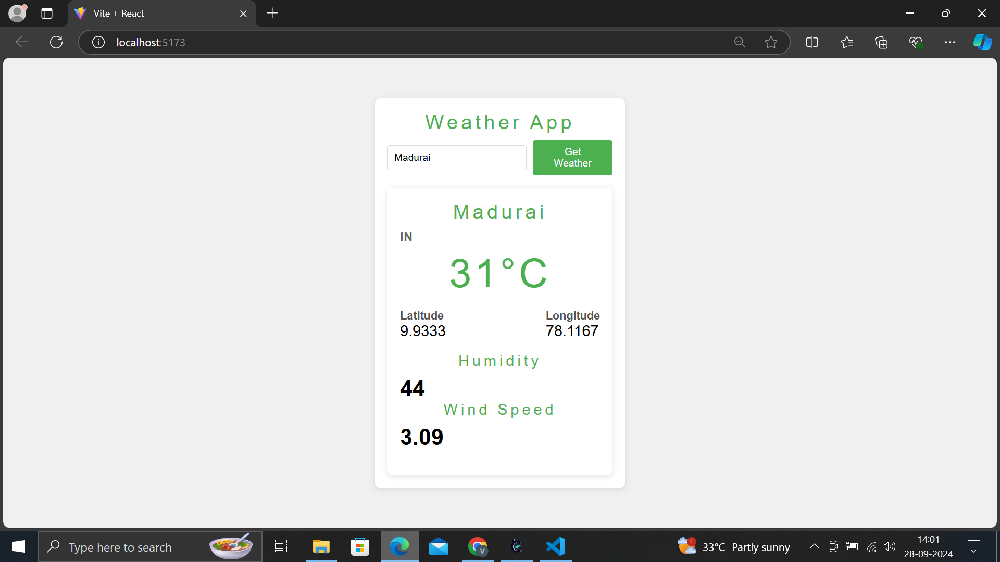

# 🌤️ Weather App

🎨 Screenshots



## 📋 Overview

The **Weather App** allows users to check the current weather conditions for any location around the globe. Users can input a city name, and the app will fetch and display detailed weather information including temperature, humidity, wind speed, and more.

## 🚀 Features

- **Search Functionality**: Users can search for the weather by city name.
- **Current Weather Data**: Displays real-time weather information, including:
  - 🌡️ Temperature
  - 💧 Humidity
  - 🌬️ Wind Speed
  - ☁️ Weather Conditions
- **User-Friendly Interface**: A clean and intuitive layout for a seamless user experience.
  
## 📦 Technologies Used

- **Frontend**: React, CSS, HTML
- **API**: OpenWeatherMap API (or any other weather API used)
- **Icons**: Font Awesome or any other icon library (if used)

## 🔧 Installation

1. Clone the repository:
   ```bash
   git clone https://github.com/RVJVIJAY/Weatherapp.git

2.**Navigate to the project directory:**

     cd weather
3.**Install dependencies using npm or yarn:**

    npm install
4.**Start the development server:**

    npm run dev
5.**Open the app in your browser:**

    Once the development server is running, open http://localhost:5173 to view the application in your browser.

📊 How It Works
* Input Field: Users can enter the name of a city.
* Fetch Weather Data: Upon submission, the app calls the weather API to fetch the current weather data for the specified city.
* Display Results: The weather information is displayed on the screen, including temperature, humidity, wind speed, and general weather conditions.

📄 Usage
* Enter the name of a city in the input field.
* Click the Get Weather button to retrieve the weather data.
* The current weather information will be displayed for the selected city.